```mermaid
graph TD
    NARRATIVE[📚 Narrative Intelligence Layer]
    NARRATIVE --> ARC[🧾 Story Arc Detection]
    NARRATIVE --> THEME[🔠Recurring Theme Analyzer]
    NARRATIVE --> CHAR[🎭 Character Development Tracker]
    NARRATIVE --> VECTOR[🧭 Narrative Vector Mapping]
```

```mermaid
graph TD
    COMMUNITY[👥 Community Interpretation Framework]
    COMMUNITY --> FRAME[ðŸ–¼ï¸ Framing Analysis]
    COMMUNITY --> MEMORY[🧠 Collective Memory Mapper]
    COMMUNITY --> REF[📌 Reference Detector]
    COMMUNITY --> SENTI[📉 Sentiment Evolution Tracker]
```

```mermaid
graph TD
    TEMPORAL[â³ Temporal Intelligence System]
    TEMPORAL --> MULTI[â²ï¸ Multi-timescale Monitoring]
    TEMPORAL --> MOMENTUM[📈 Narrative Momentum Calculator]
    TEMPORAL --> DORMANT[🧊 Dormancy Predictor]
    TEMPORAL --> LIFECYCLE[🔠Lifecycle Projector]
```

# 🧠 Meme Syndicate Protocol  
### A Vector-Based Multi-Agent Framework for Memecoin Analytics and Deployment

[](https://opensource.org/licenses/MIT)  
[](https://www.python.org/downloads/)  
[](https://github.com/hwchase17/langchain)  
[](https://github.com/chroma-core/chroma)

---

## 🚀 Abstract

Memecoins are more than jokes — they’re emergent financial narratives. This protocol introduces a **multi-agent architecture** that autonomously analyzes memetic data, scores coinability, and launches assets based on narrative momentum.

The **Meme Syndicate Protocol (MSP)** integrates:

- 🔁 ReAct loops (Reasoning + Acting)
- 🧬 ChromaDB vector memory
- 🧠 Specialized agents (research, sentiment, narrative)
- 🤖 Autonomous token deployment + tracking

---

## 📌 Motivation

Memecoins aren’t powered by fundamentals — they’re driven by **narrative velocity**, **cultural friction**, and **community signal volume**. Traditional analysis fails here.

This system is purpose-built to:

- Detect memes before they viralize  
- Understand cultural arcs  
- Predict meme lifecycles  
- Score "coinability" in real time  
- Deploy tokens & track performance  

---

## 🏗️ System Architecture


---

## 🔄 ReAct Operational Cycle


Each phase of this cycle maps to:

- **Observe**: Agents fetch current state and data  
- **Think**: Hypothesis and reasoning over observed conditions  
- **Act**: Research, analysis, or decision  
- **Reflect**: Log outcomes into `reflection_collection` for future ReAct cycles  

---

## 🧬 Vector Database Collections

- `research_collection`: Market news, data, on-chain metrics  
- `sentiment_collection`: Social platform analysis + emotion tracking  
- `technical_collection`: Charting, RSI, MACD, price signal vectors  
- `reflection_collection`: Thought logs + strategic insight history  

Each vector is stored with:

- Timestamp + Source metadata  
- Confidence + reliability scores  
- Contextual tags  

---

## 🧠 Agent Specializations

**1. Research Agent (RA)**  
Gathers factual, market, and news-based data. Web-scrapes and encodes for ChromaDB.

**2. Sentiment Agent (SA)**  
Tracks meme waves, community sentiment, and platform growth using NLP.

**3. Technical Agent (TA)**  
Monitors indicators like RSI, MACD, Bollinger Bands — outputs trend vectors.

**4. Portfolio Manager (PM)**  
Risk-optimized position sizing + allocation.

**5. Strategy Coordinator (SC)**  
Synthesizes all intel and finalizes decisions. Detects conflicting signals and requests clarification loops.

---

## 🧠 System Intelligence Layers

### Narrative Intelligence



---

### Community Interpretation Framework



---

### Temporal Intelligence System



---

### Coinability Index Engine

```mermaid
graph TD
    CI[🎯 Coinability Index Engine]
    CI --> VIRAL[Viral Potential]
    CI --> DISTINCT[Distinctiveness Score]
    CI --> RESONANCE[Cultural Resonance]
    CI --> IMPLEMENT[Launch Feasibility]
```



---

## 📈 Sample Use Case Output

```
📊 MEMECOIN ANALYSIS REPORT

📅 Date: 2024-03-15
📈 Sentiment Surge Detected: "PEPE.AI" on TikTok, Twitter, and Discord
📉 RSI: 34.2 (Oversold), MACD divergence forming
🧠 Narrative Score: "Redemption Arc + Meta-Meme Crossover"
🎯 CI Score: 88.6

🪙 Recommended Action:
✅ Mint candidate
✅ Short-term swing potential
✅ Meme-to-product ecosystem optionality
```

---

## 📜 References

- Yao et al. (2022) — ReAct: Synergizing Reasoning and Acting  
- Chen et al. (2021) — Vector Memory in AI Decision Systems  
- Zhang & Peterson (2023) — Multi-Modal Crypto Forecasting  
- Garcia & Williams (2023) — ChromaDB Architecture  
- Thompson et al. (2021) — Memecoin Market Dynamics  
