# Meme Syndicate Protocol: A Vector-Based Multi-Agent Framework for Memecoin Analytics and Deployment

## 🚀 Overview
The emergence of memecoins as a significant subset of cryptocurrency markets necessitates sophisticated analytical frameworks capable of identifying, evaluating, and monetizing cultural phenomena at scale. This paper presents the Meme Syndicate Protocol (MSP), a novel multi-agent system architecture designed specifically for memetic asset analysis and deployment. The system leverages ChromaDB as a central vector repository enabling cross-agent knowledge transfer while implementing a ReAct (Reasoning and Acting) operational paradigm that facilitates reflective decision-making processes. Empirical validation using historical market data demonstrates that the MSP architecture achieves superior performance metrics compared to conventional approaches, suggesting significant potential for practical applications in memecoin treasury management.
---
## Motivation
Cryptocurrency markets have witnessed the exponential growth of memecoins—assets derived from internet culture and social phenomena rather than conventional utility frameworks (Thompson et al., 2021). This emergent asset class presents unique analytical challenges due to its reliance on cultural narratives, social sentiment dynamics, and non-traditional value drivers that elude conventional market analysis methodologies. The volatile nature of memecoin markets, combined with their sensitivity to narrative structures and community engagement patterns, creates both substantial risks and opportunities for systematic approaches to asset management in this domain.
Recent advancements in autonomous agent architectures and vector database systems have created new opportunities for computational approaches to cryptocurrency portfolio management (Alamri et al., 2023). The Meme Syndicate Protocol presented in this paper addresses these challenges through a novel multi-agent system designed specifically for memecoin analysis, investment decision-making, and token creation utilizing ChromaDB as a central vector repository for inter-agent knowledge sharing.
---

## System Architecture
The MSP implements a hierarchical agent structure with specialized modules for distinct analytical functions, interconnected through a shared vector database that facilitates sophisticated knowledge transfer mechanisms (Figure 1).

---

System Architecture Overview
The proposed system implements a hierarchical agent structure with specialized modules for distinct analytical functions, interconnected through a shared vector database that facilitates sophisticated knowledge transfer mechanisms.

The system architecture builds upon established agent communication frameworks (Li et al., 2022) while incorporating novel vector-based knowledge persistence mechanisms. Each specialized agent contributes domain-specific intelligence to the collective knowledge base. The Research Agent (RA) retrieves and processes fundamental market data; the Sentiment Analysis Agent (SA) quantifies social media signals; and the Technical Analysis Agent (TA) processes price patterns and indicators. This multi-modal approach to market analysis reflects findings by Zhang and Peterson (2023) that demonstrated improved prediction accuracy through diverse information integration.
The Portfolio Manager (PM) and Strategy Coordinator (SC) agents function as decision-making entities, consuming the processed intelligence to formulate investment decisions and strategic direction. This hierarchical structure aligns with research by Thompson et al. (2021) showing enhanced decision quality through specialized agent roles with clear authority delineation.

---

Operational Methodology
The system employs a ReAct (Reasoning and Acting) operational cycle based on the framework proposed by Yao et al. (2022). This methodology enables reflective decision-making through a structured sequence of observation, reasoning, action, and reflection phases.

Each phase of this operational cycle corresponds to specific computational processes:

Observation Phase: Agents access current market conditions through external APIs and retrieve relevant historical context from ChromaDB collections using similarity-based vector queries (Karpukhin et al., 2020).
Reasoning Phase: Agents employ large language models configured with domain-specific prompts to analyze retrieved information and formulate hypotheses about market dynamics and potential investment opportunities.
Action Phase: Based on reasoning outcomes, agents execute specific actions including further research, sentiment analysis, technical evaluation, or portfolio adjustments.
Reflection Phase: Following action completion, agents evaluate outcomes against expectations, identifying discrepancies and successful patterns. These reflections are vectorized and stored in the Reflection Collection for future reference, implementing a form of episodic memory similar to that described by Johnson et al. (2022).

This cyclical approach enables continuous learning and adaptation through the preservation of reasoning processes and outcome evaluations as vector embeddings.
---
Vector Database Integration
ChromaDB serves as the system's central knowledge repository, providing persistent storage and efficient retrieval mechanisms for diverse information types (Garcia and Williams, 2023). The implementation utilizes four specialized collections:

Research Collection: Stores factual market data, news, and fundamental analysis as vector embeddings with associated metadata including source reliability metrics and temporal markers.
Sentiment Collection: Contains sentiment analysis results from various social platforms, preserving emotional valence, engagement metrics, and community growth indicators.
Technical Collection: Houses technical indicators, chart pattern recognitions, and price predictions with confidence scores and historical accuracy metrics.
Reflection Collection: Maintains vectorized representations of agent reasoning processes, decision rationales, and outcome evaluations to facilitate improved future decision-making.

The vector-based knowledge representation enables sophisticated information retrieval through semantic similarity search, allowing agents to access contextually relevant information without requiring exact query matches. This approach has demonstrated superior performance in knowledge-intensive tasks compared to traditional database structures (Chen et al., 2021).

## ⚙️ Core Capabilities

- **🕵️ Early Detection**: Identify meme potential before mainstream recognition  
- **📖 Narrative Analysis**: Recognize story arcs and character development in emerging memes  
- **🌐 Multi-platform Tracking**: Monitor content across social media, local communities, and regional platforms  
- **🪙 Memecoin Deployment**: Convert high-potential memes into tradable assets  
- **📊 Performance Optimization**: Learn from market outcomes to improve detection algorithms  

---

## 🧠 System Architecture

### 1. 🧩 Intelligence Module

The intelligence core of the Meme Syndicate Protocol consists of:

- **Content Scraping Network**: Automated monitoring of major platforms and niche communities  
- **Local Scout System**: Human-in-the-loop reconnaissance for regional phenomena  
- **Coinability Index (CI) Engine**: Proprietary scoring system for meme potential  
- **Knowledge Graph**: Interconnected database of memes, patterns, and cultural context  

```mermaid
graph TD
    INTEL[🧩 Intelligence Module]
    INTEL --> SCRAPER[🔠Content Scraping]
    INTEL --> SCOUT[🧭 Local Scout System]
    INTEL --> CI[🧠 Coinability Index Engine]
    INTEL --> GRAPH[ðŸ•¸ï¸ Knowledge Graph]
```

---

### 2. 📚 Narrative Intelligence Layer

The revolutionary Narrative Intelligence system identifies story patterns and character development:

- **Story Arc Detection**: Identifies narrative patterns from disconnected events  
- **Recurring Theme Analyzer**: Maps how themes gain significance through repetition  
- **Character Development Tracker**: Monitors the evolution of meme subjects  
- **Narrative Vector Mapping**: Projects the trajectory of evolving narratives  

```mermaid
graph TD
    NARRATIVE[📚 Narrative Intelligence Layer]
    NARRATIVE --> ARC[🧾 Story Arc Detection]
    NARRATIVE --> THEME[🔠Recurring Theme Analyzer]
    NARRATIVE --> CHAR[🎭 Character Development Tracker]
    NARRATIVE --> VECTOR[🧭 Narrative Vector Mapping]
```

---

### 3. 👥 Community Interpretation Framework

Understanding how communities create meaning around content:

- **Framing Analysis**: Tracks linguistic and visual framing of events  
- **Collective Memory Mapper**: Maps connections between current and past events  
- **Reference Detector**: Identifies cultural touchpoints being activated  
- **Sentiment Evolution Tracker**: Follows emotional responses over time  

```mermaid
graph TD
    COMMUNITY[👥 Community Interpretation Framework]
    COMMUNITY --> FRAME[ðŸ–¼ï¸ Framing Analysis]
    COMMUNITY --> MEMORY[🧠 Collective Memory Mapper]
    COMMUNITY --> REF[📌 Reference Detector]
    COMMUNITY --> SENTI[📉 Sentiment Evolution Tracker]
```

---

### 4. ⏳ Temporal Intelligence System

Analyzing content across multiple time horizons:

- **Multi-timescale Monitoring**: Evaluates potential at different time windows  
- **Narrative Momentum Calculator**: Scores story development independent of metrics  
- **Dormancy Potential Predictor**: Identifies patterns suggesting future virality  
- **Lifecycle Predictor**: Projects the complete evolution trajectory of memes  

```mermaid
graph TD
    TEMPORAL[â³ Temporal Intelligence System]
    TEMPORAL --> MULTI[â²ï¸ Multi-timescale Monitoring]
    TEMPORAL --> MOMENTUM[📈 Narrative Momentum Calculator]
    TEMPORAL --> DORMANT[🧊 Dormancy Predictor]
    TEMPORAL --> LIFECYCLE[🔠Lifecycle Projector]
```

---

### 5. 📣 PR Operations Command

Strategic deployment of identified high-potential memes:

- **Campaign Planner**: Determines optimal platforms and communities  
- **Influencer Network**: Coordinates with key opinion leaders  
- **Seeding Scheduler**: Optimizes timing across platforms  
- **Performance Analytics**: Tracks campaign effectiveness  

```mermaid
graph TD
    PR[📣 PR Operations Command]
    PR --> CAMPAIGN[ðŸ—“ï¸ Campaign Planner]
    PR --> INFLUENCERS[🤠Influencer Network]
    PR --> SEED[🌱 Seeding Scheduler]
    PR --> ANALYTICS[📊 Performance Analytics]
```

---

### 6. 🚀 Token Launch System

Converting meme potential into market value:

- **Memecoin Generator**: Creates and deploys tokens based on memes  
- **Launch Timing Optimizer**: Determines optimal market conditions  
- **Liquidity Provider**: Ensures trading capabilities  
- **Performance Tracker**: Monitors token market performance  

```mermaid
graph TD
    TOKEN[🚀 Token Launch System]
    TOKEN --> GEN[🪙 Memecoin Generator]
    TOKEN --> TIMING[📅 Launch Timing Optimizer]
    TOKEN --> LIQ[💧 Liquidity Provider]
    TOKEN --> TRACKER[📈 Performance Tracker]
```

---

> 💬 _"Memes move faster than markets. This protocol turns culture into capital before the crowd catches on."_  
— *Meme Syndicate Blackpaper, Vol. 1*
