# 🧠 Meme Syndicate Protocol

## 🪙 Overview

The **Meme Syndicate Protocol** is an advanced intelligence and deployment system for identifying, analyzing, and monetizing high-potential memes through cryptocurrency creation. By integrating narrative intelligence, community analysis, and temporal pattern recognition, the system identifies memetic potential **before conventional metrics detect it**.

```mermaid
graph TD
    CEO[👑 CEO]
    CIO[🧠 CIO]
    COO[🎯 COO]
    CTO[💻 CTO]
    CFO[💰 CFO]
    SU[🕶️ Special Ops]

    %% Executive hierarchy
    CEO --> CIO
    CEO --> COO
    CEO --> CTO
    CEO --> CFO
    CEO --> SU

    %% Divisions
    CIO --> ID[📡 Intelligence Div]
    COO --> OD[🚀 Ops Div]
    CTO --> TD[💻 Tech Div]
    CFO --> FD[🏦 Finance Div]

    %% Compact Units
    ID --> ID1[Meme Detect]
    ID --> ID2[Narrative Engine]

    OD --> OD1[PR Ops]
    OD --> OD2[Influencer Relay]

    TD --> TD1[Alg Dev]
    TD --> TD2[Infra]

    FD --> FD1[Token Launch]
    FD --> FD2[Risk Engine]

    SU --> SU1[🌀 Trend Lab]
    SU --> SU2[⚖️ Ethics Council]
```

---

## ⚙️ Core Capabilities

- **🕵️ Early Detection**: Identify meme potential before mainstream recognition  
- **📖 Narrative Analysis**: Recognize story arcs and character development in emerging memes  
- **🌐 Multi-platform Tracking**: Monitor content across social media, local communities, and regional platforms  
- **🪙 Memecoin Deployment**: Convert high-potential memes into tradable assets  
- **📊 Performance Optimization**: Learn from market outcomes to improve detection algorithms  

---

## 🧠 System Architecture

### 1. 🧩 Intelligence Module

The intelligence core of the Meme Syndicate Protocol consists of:

- **Content Scraping Network**: Automated monitoring of major platforms and niche communities  
- **Local Scout System**: Human-in-the-loop reconnaissance for regional phenomena  
- **Coinability Index (CI) Engine**: Proprietary scoring system for meme potential  
- **Knowledge Graph**: Interconnected database of memes, patterns, and cultural context  

```mermaid
graph TD
    INTEL[🧩 Intelligence Module]
    INTEL --> SCRAPER[🔍 Content Scraping Network]
    INTEL --> SCOUT[🧭 Local Scout System]
    INTEL --> CI[🧠 Coinability Index Engine]
    INTEL --> GRAPH[🕸️ Knowledge Graph]
```

---

### 2. 📚 Narrative Intelligence Layer

The revolutionary Narrative Intelligence system identifies story patterns and character development:

- **Story Arc Detection**: Identifies narrative patterns from disconnected events  
- **Recurring Theme Analyzer**: Maps how themes gain significance through repetition  
- **Character Development Tracker**: Monitors the evolution of meme subjects  
- **Narrative Vector Mapping**: Projects the trajectory of evolving narratives  

---

### 3. 👥 Community Interpretation Framework

Understanding how communities create meaning around content:

- **Framing Analysis**: Tracks linguistic and visual framing of events  
- **Collective Memory Mapper**: Maps connections between current and past events  
- **Reference Detector**: Identifies cultural touchpoints being activated  
- **Sentiment Evolution Tracker**: Follows emotional responses over time  

---

### 4. ⏳ Temporal Intelligence System

Analyzing content across multiple time horizons:

- **Multi-timescale Monitoring**: Evaluates potential at different time windows  
- **Narrative Momentum Calculator**: Scores story development independent of metrics  
- **Dormancy Potential Predictor**: Identifies patterns suggesting future virality  
- **Lifecycle Predictor**: Projects the complete evolution trajectory of memes  

---

### 5. 📣 PR Operations Command

Strategic deployment of identified high-potential memes:

- **Campaign Planner**: Determines optimal platforms and communities  
- **Influencer Network**: Coordinates with key opinion leaders  
- **Seeding Scheduler**: Optimizes timing across platforms  
- **Performance Analytics**: Tracks campaign effectiveness  

---

### 6. 🚀 Token Launch System

Converting meme potential into market value:

- **Memecoin Generator**: Creates and deploys tokens based on memes  
- **Launch Timing Optimizer**: Determines optimal market conditions  
- **Liquidity Provider**: Ensures trading capabilities  
- **Performance Tracker**: Monitors token market performance  

---

> 💬 _"Memes move faster than markets. This protocol turns culture into capital before the crowd catches on."_  
— *Meme Syndicate Blackpaper, Vol. 1*
